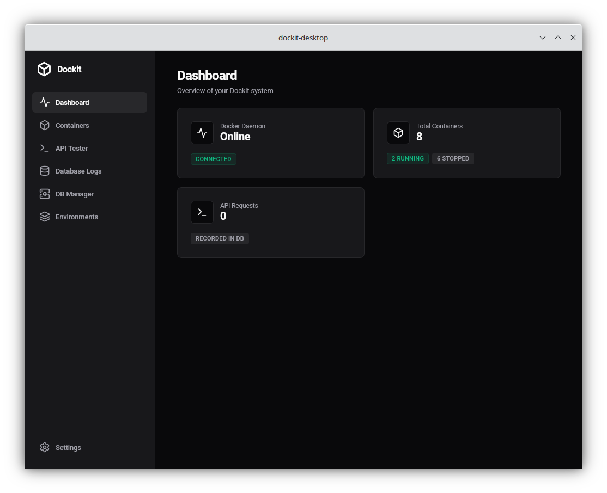
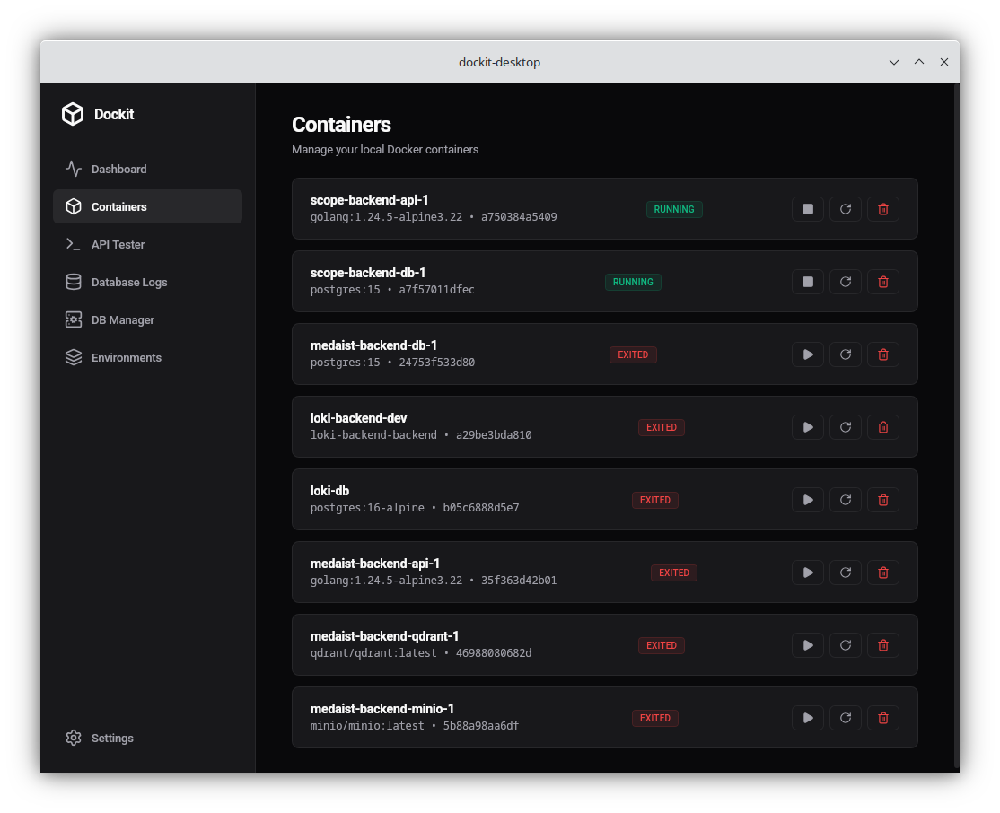
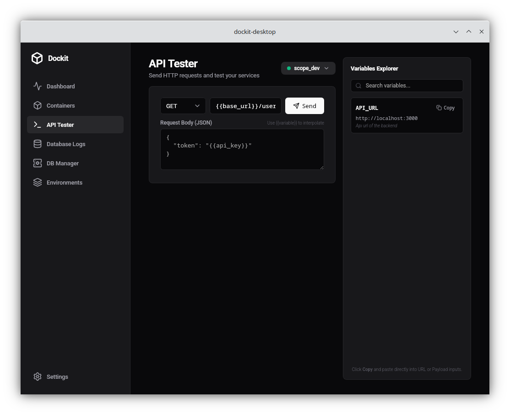
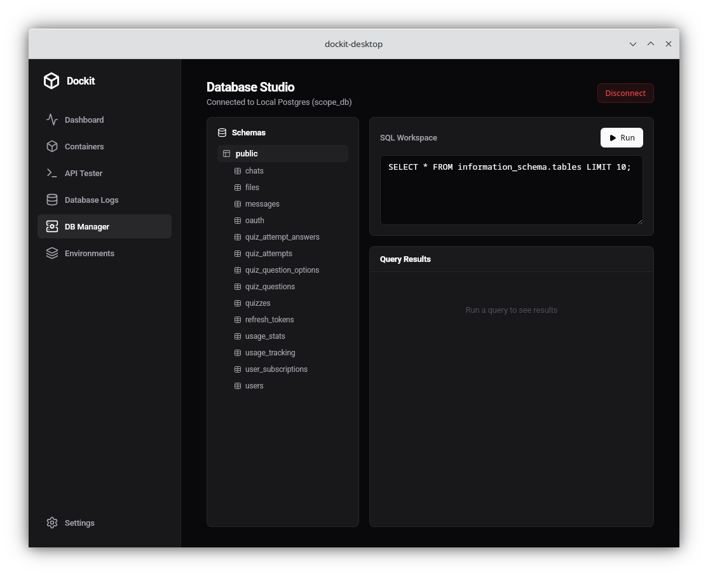
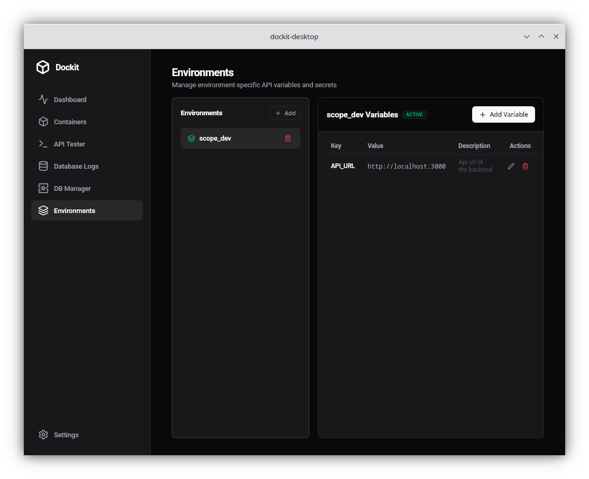

# Dockit Desktop

Dockit Desktop is a Wails (Go + React) desktop app for managing local Docker resources, testing APIs, and organizing environment variables. It includes a lightweight local SQLite store for request history and a PostgreSQL manager for external database connections.

## Table of Contents
- Overview
- Key Features
- Screenshots
- Quick Start
- Build
- Usage Guide
- Data and Security
- Project Structure
- Troubleshooting
- FAQ
- Contributing
- License

## Overview
Dockit Desktop brings common devops and API tasks into a single desktop UI:
- Monitor Docker daemon health and container status
- Start, stop, restart, and remove containers
- Send HTTP requests with environment variable interpolation
- Review API request history
- Connect to PostgreSQL, browse schemas, and run SQL

## Key Features
- **Docker Dashboard**: daemon status, container counts, and quick stats
- **Container Manager**: lifecycle actions and live status badges
- **API Tester**: JSON payloads, response preview, and variable injection
- **Database Logs**: local request history stored in SQLite
- **DB Manager**: PostgreSQL connections, schemas, tables, and SQL execution
- **Encrypted Secrets**: environment variable values are encrypted at rest

## Screenshots
Dashboard


Containers


API Tester


DB Manager


Environments


## Quick Start
### Prerequisites
- Go 1.25+
- Node.js 18+ and npm
- Wails CLI: `go install github.com/wailsapp/wails/v2/cmd/wails@latest`
- Docker Engine or Docker Desktop (required for Docker pages)
- PostgreSQL server (optional, for DB Manager)

### Install Frontend Dependencies
```bash
npm install --prefix frontend
```

### Run in Development
```bash
wails dev
```

This starts Vite and the Wails dev server. You can access devtools at `http://localhost:34115`.

## Build
```bash
wails build
```

Optional frontend-only build:
```bash
npm run build --prefix frontend
```

## Usage Guide
### Docker
- Make sure Docker is running locally. The Dashboard shows daemon status.
- The Containers page allows start/stop/restart/remove actions.

### API Tester
- Use the API Tester to send requests and inspect responses.
- If an environment is active, `{{variable}}` placeholders are resolved on the backend.

### Environments
- Create named environments (e.g. Dev, Staging, Prod).
- Add variables and mark sensitive values as secret.
- Secrets are encrypted and masked in the UI.

### DB Manager
- Only PostgreSQL is supported for now.
- Default SSL mode is `prefer` if left empty.
- Use host, port, user, and database values that are reachable from your machine.

## Data and Security
- Local data is stored in `dockit.db` (SQLite) in the project root.
- SQLite WAL files (`dockit.db-wal`, `dockit.db-shm`) are expected during use.
- Environment variables are encrypted at rest using AES-256-GCM.
- The encryption key is stored in the OS keyring and never written to disk in plaintext.

## Project Structure
- `main.go` Wails app entrypoint
- `app.go` app lifecycle wiring
- `bindings/` Wails bindings exposed to the frontend
- `internal/`
  - `domain/` core models
  - `ports/` interfaces
  - `usecase/` business logic
  - `infrastructure/` adapters (docker, sqlite, crypto, dbmanager)
- `frontend/` React UI (Vite)

## Troubleshooting
- **Docker pages show offline**: verify Docker is running with `docker info`.
- **DB Manager cannot connect**: check host/port/firewall and PostgreSQL user access.
- **Keyring errors on Linux**: ensure a keyring service (e.g. gnome-keyring) is running.
- **Build fails**: run `gofmt -w ./...` and `npm install --prefix frontend` again.

## FAQ
**Is this a server app?**
No. Dockit Desktop is a local desktop UI that uses local Docker and local data.

**Where are API logs stored?**
In the local SQLite file `dockit.db`.

**Are environment secrets safe?**
Secrets are encrypted at rest. The key is stored in the OS keyring.

## Contributing
See `CONTRIBUTING.md` for development details and contribution guidelines.

## License
See `LICENSE` for license details.
